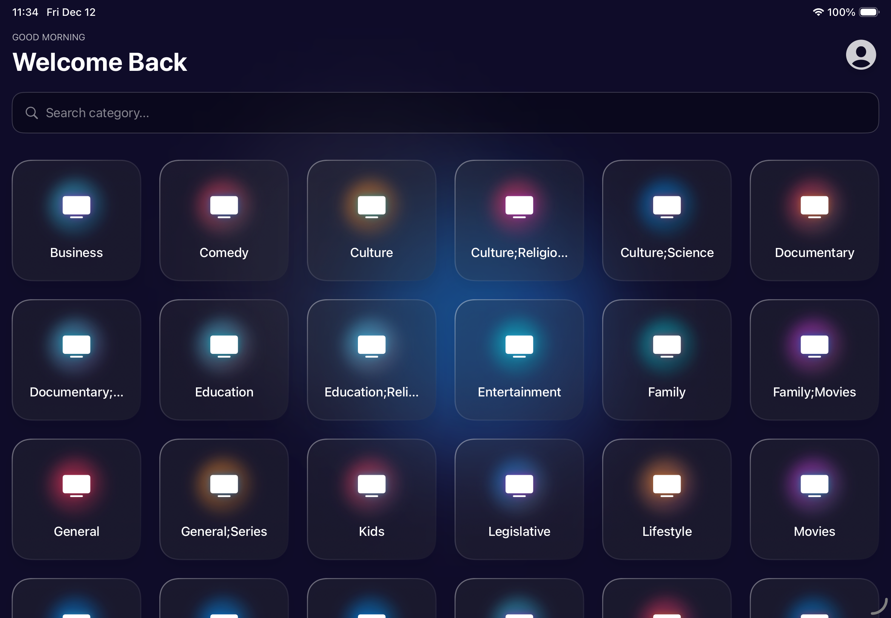

# 📺 IPTV Access - iOS Player

Un player IPTV moderno, open source e nativo per iOS, scritto interamente in SwiftUI.



## ✨ Funzionalità
- **Multi-Protocollo:** Supporto nativo per **Xtream Codes**, **Stalker Portal** e Playlist **M3U**.
- **Liquid Glass UI:** Interfaccia moderna con animazioni fluide e sfocature in tempo reale.
- **Picture-in-Picture (PiP):** Guarda i tuoi canali mentre usi altre app o navighi nei menu.
- **Auto-Reconnect:** Riconnessione intelligente se lo stream cade.
- **Multilingua:** Supporto Italiano 🇮🇹 e Inglese 🇺🇸.

## 📲 Come Installare (AltStore)

Non serve compilare il codice! Puoi installare l'app direttamente tramite AltStore.

1. Copia questo link:
   `https://raw.githubusercontent.com/Emanuel5014/IPTV-Access/main/apps.json`
   
2. Apri **AltStore** sul tuo iPhone/iPad.
3. Vai su **My Apps** -> **+** -> **Add Source**.
4. Incolla il link e tocca **Add**.
5. Cerca "IPTV Access" e installa!

## 🛠 Compilare da Codice (Sviluppatori)

1. Clona la repository:
   ```bash
   git clone [https://github.com/Emanuel5014/IPTV-Access.git](https://github.com/Emanuel5014/IPTV-Access.git)